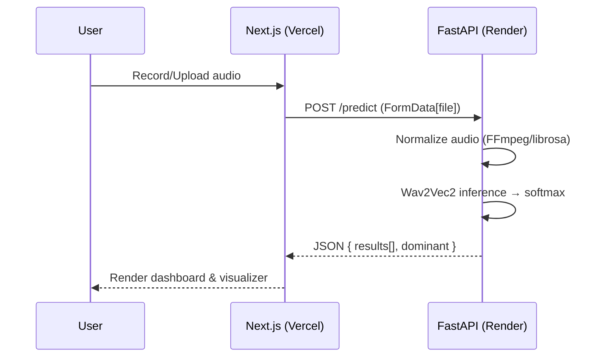

# SER_wav2vec

Turn short voice clips into emotions with a Wav2Vec2 model, a FastAPI backend, and a sleek Next.js UI.

## Highlights
- Real‑time recording and upload with animated visualizer
- Clean emotion dashboards with dominant label and per‑class scores
- Deployable today: backend on Render, frontend on Vercel

## Feature Matrix

| Area     | Capability                              | Notes |
|----------|------------------------------------------|-------|
| Backend  | `POST /predict` (FastAPI)                | Returns sorted emotions + dominant |
| Backend  | FFmpeg audio normalization               | 16 kHz mono, padding for short clips |
| Frontend | Record/upload audio                      | Visualizer + theme toggle |
| Frontend | Results dashboard                        | Cards + progress bars per emotion |
| Deploy   | Render (BE), Vercel (FE)                 | CORS configured for cross-origin |

## Project Structure
- `ser_backend/` FastAPI server and model assets
- `ser_web/` Next.js app (App Router, TypeScript, Tailwind)

## Quick Start (Local)
- Backend
  - `cd ser_backend`
  - Create venv (PowerShell): `python -m venv .venv; .\.venv\Scripts\Activate.ps1`
  - `pip install -r requirements.txt`
  - Ensure FFmpeg is installed
  - Run: `$env:MODEL_DIR = "$PWD\best_model"; uvicorn server:app --host 0.0.0.0 --port 8000`
- Frontend
  - `cd ser_web`
  - `npm install`
  - `.env.local`: `NEXT_PUBLIC_API_URL=http://127.0.0.1:8000`
  - `npm run dev` → open `http://localhost:3000`

## API
- `POST /predict` form‑data: `file` (audio)
- Response: `{ results: [{ label, score }...], dominant: { label, score } }`
- Example
```bash
curl -X POST \
  -F "file=@sample.wav" \
  https://ser-wav2vec.onrender.com/predict
```

## Model Details
- Architecture: `Wav2Vec2ForSequenceClassification` fine‑tuned for emotion classification
- Labels: `angry`, `calm`, `disgust`, `fear`, `happy`, `neutral`, `sad`, `surprise`
- Sampling rate: `16000 Hz` mono (inputs are resampled and converted to mono)
- Files: `ser_backend/best_model/` → `config.json`, `model.safetensors`, `preprocessor_config.json`, `training_args.bin`
- Inference
  - Audio converted to 16 kHz mono (FFmpeg preferred; fallback to `soundfile`/`librosa`)
  - Very short inputs (< ~0.1s) padded to ~1s for stability
  - Probabilities via softmax over logits sorted by confidence

## Deploy

### Backend on Render
- Environment: Python
- Root Directory: `ser_backend`
- Build Command:
  - `apt-get update && apt-get install -y ffmpeg && pip install -r requirements.txt`
- Start Command:
  - `uvicorn server:app --host 0.0.0.0 --port $PORT --workers ${WEB_CONCURRENCY:-1}`
- Environment Variables
  - `MODEL_DIR=best_model`
  - `FFMPEG_BIN=ffmpeg`
  - `CORS_ORIGINS=https://<your-vercel-domain>`
  - Optional fallback if LFS not available: `MODEL_REPO_ID=<your-hf-repo-id>`
  - Optional performance: `WEB_CONCURRENCY=2`, `TORCH_NUM_THREADS=1`, `TORCH_NUM_INTEROP_THREADS=1`
- Health
  - `GET /` returns `{ "status": "ok" }`
  - `HEAD /` supported; `GET /favicon.ico` returns `204`

### Frontend on Vercel
- Framework Preset: `Next.js`
- Root Directory: `ser_web`
- Build Command: `npm run build`
- Start Command: `npm run start`
- Environment Variables
  - `NEXT_PUBLIC_API_URL=https://ser-wav2vec.onrender.com`
- The app posts directly to `${NEXT_PUBLIC_API_URL}/predict` from the browser.

## Limits (Free Tier)
- Audio length: short clips only (≈ 4–5 seconds)
- Reason: limited CPU/memory on free instances and request timeouts
- Tip: keep inputs small, avoid long recordings, and prefer mono 16 kHz

| Limit            | Value            | Reason               |
|------------------|------------------|----------------------|
| Max audio length | ~5 seconds       | Free tier resources  |
| Channels         | Mono             | Consistent features  |
| Sample rate      | 16 kHz           | Model expectation    |

## Troubleshooting
- CORS blocked
  - Set `CORS_ORIGINS` to your Vercel domain on Render
- 502 Bad Gateway
  - Backend may be sleeping or cold starting; wait or upgrade plan
  - Ensure model weights are present (Git LFS or Hugging Face fallback)
- Slow responses
  - Enable `uvicorn[standard]` and `orjson` (included)
  - Reduce `WEB_CONCURRENCY`/Torch threads for small instances

## Repository Structure

### Backend (`ser_backend`)
```
ser_backend/
├─ best_model/
│  ├─ config.json
│  ├─ model.safetensors
│  ├─ preprocessor_config.json
│  └─ training_args.bin
├─ requirements.txt
└─ server.py
```

### Frontend (`ser_web`)
```
ser_web/
├─ app/
│  ├─ api/
│  │  └─ ser/route.ts
│  ├─ layout.tsx
│  └─ page.tsx
├─ components/
│  ├─ components/
│  │  ├─ pulsating-loader.tsx
│  │  └─ ui/ai-voice-input.tsx
│  ├─ lib/utils.ts
│  └─ ui/
│     ├─ ai-voice-input.tsx
│     ├─ card.tsx
│     ├─ progress.tsx
│     ├─ pulsating-loader.tsx
│     └─ voice-input.tsx
├─ lib/utils.ts
├─ styles/globals.css
├─ .env.local.example
├─ components.json
├─ next-env.d.ts
├─ next.config.js
├─ package.json
├─ package-lock.json
├─ postcss.config.js
├─ tailwind.config.ts
└─ tsconfig.json
```

## Flow Diagram



## Example Emotion Scores

```text
Emotion     Score (%)
Happy       ███████████████████░ 85
Neutral     ███████████░░░░░░░░ 52
Calm        ██████████░░░░░░░░░ 48
Surprise    ███████░░░░░░░░░░░░ 33
Angry       ███░░░░░░░░░░░░░░░░ 15
Sad         ██░░░░░░░░░░░░░░░░░ 12
Disgust     ██░░░░░░░░░░░░░░░░░ 10
Fear        █░░░░░░░░░░░░░░░░░░ 6
```
